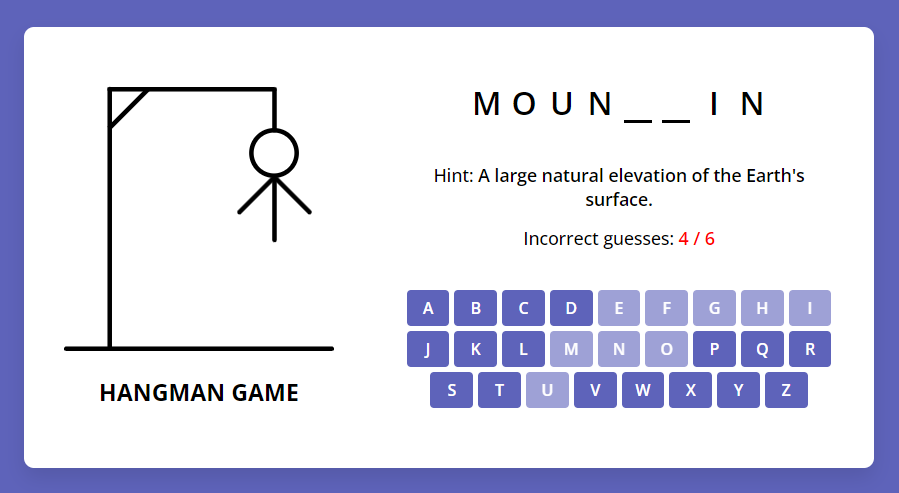

# Hangman Game
Hangman Game is a classic guessing game that is fun and tense. This game can be played by two or more people, and relies on the ability to think and guess.

## Benefits of playing Hangman Game:
* Test vocabulary knowledge. The players have to think of various letters to be able to guess the secret word or phrase.
* Train thinking skills. The players must use logic to guess the letters that may be in a secret word or phrase.
* Tense and fun. Players will feel tense when the shadow executioner is almost completely drawn, and happy when they successfully guess the secret word or phrase.

# Screenshot
Here we have project screenshot :

## LICENSE
> Copyright (c) 2024 Devis Wisley 
>
> Permission is hereby granted, free of charge, to any person obtaining a copy
> of this software and associated documentation files (the "Software"), to deal
> in the Software without restriction, including without limitation the rights
> to use, copy, modify, merge, publish, distribute, sublicense, and/or sell
> copies of the Software, and to permit persons to whom the Software is
> furnished to do so, subject to the following conditions:
>
> The above copyright notice and this permission notice shall be included in all
> copies or substantial portions of the Software.
>
> THE SOFTWARE IS PROVIDED "AS IS", WITHOUT WARRANTY OF ANY KIND, EXPRESS OR
> IMPLIED, INCLUDING BUT NOT LIMITED TO THE WARRANTIES OF MERCHANTABILITY,
> FITNESS FOR A PARTICULAR PURPOSE AND NONINFRINGEMENT. IN NO EVENT SHALL THE
> AUTHORS OR COPYRIGHT HOLDERS BE LIABLE FOR ANY CLAIM, DAMAGES OR OTHER
> LIABILITY, WHETHER IN AN ACTION OF CONTRACT, TORT OR OTHERWISE, ARISING FROM,
> OUT OF OR IN CONNECTION WITH THE SOFTWARE OR THE USE OR OTHER DEALINGS IN THE
> SOFTWARE.

Developed with ❤️ in Indonesia 

