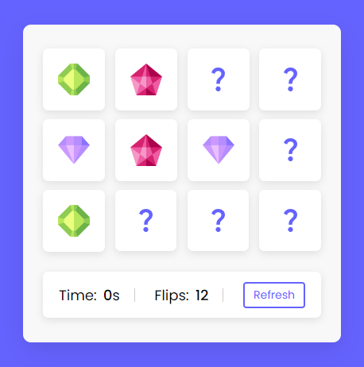

# Memory Card
Memory Card is a classic game that relies on memory and is suitable for all ages. This game usually uses a deck of cards placed upside down, and the goal is to find pairs of identical cards.

## Benefits of playing Memory Card:
* Training memory: The point of this game is to remember the location of the cards you have seen. This helps train and strengthen memory, especially short-term memory.
* Improves concentration: Players must focus and concentrate to remember the location of the cards they have seen.
* Prevents dementia: This game can help maintain brain health and prevent dementia in old age.
* Fun and easy to play: Memory Card is simple and easy to learn, making it perfect for playing with family and friends.
* Cheap and flexible: This game does not require much equipment and can be played with a variety of cards or other media.

# Screenshot
Here we have project screenshot :

## LICENSE
> Copyright (c) 2024 Devis Wisley 
>
> Permission is hereby granted, free of charge, to any person obtaining a copy
> of this software and associated documentation files (the "Software"), to deal
> in the Software without restriction, including without limitation the rights
> to use, copy, modify, merge, publish, distribute, sublicense, and/or sell
> copies of the Software, and to permit persons to whom the Software is
> furnished to do so, subject to the following conditions:
>
> The above copyright notice and this permission notice shall be included in all
> copies or substantial portions of the Software.
>
> THE SOFTWARE IS PROVIDED "AS IS", WITHOUT WARRANTY OF ANY KIND, EXPRESS OR
> IMPLIED, INCLUDING BUT NOT LIMITED TO THE WARRANTIES OF MERCHANTABILITY,
> FITNESS FOR A PARTICULAR PURPOSE AND NONINFRINGEMENT. IN NO EVENT SHALL THE
> AUTHORS OR COPYRIGHT HOLDERS BE LIABLE FOR ANY CLAIM, DAMAGES OR OTHER
> LIABILITY, WHETHER IN AN ACTION OF CONTRACT, TORT OR OTHERWISE, ARISING FROM,
> OUT OF OR IN CONNECTION WITH THE SOFTWARE OR THE USE OR OTHER DEALINGS IN THE
> SOFTWARE.

Developed with ❤️ in Indonesia 

