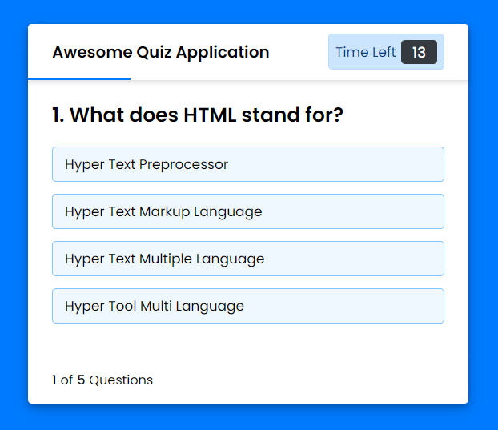

# Quiz App
Quiz App is a mobile or web application that allows users to take interactive quizzes on various topics.

## Benefits of playing Quiz App:
* Increase knowledge: Quiz App can help users to increase their knowledge on various topics.
* Training critical thinking skills: Quiz App can help users to train their critical thinking skills by answering challenging questions.
* Improve memory: Quiz App can help users to improve their memory by remembering the answers to the questions they have answered.
* Improves concentration: Quiz App can help users to improve their concentration by focusing on answering questions.
* Fun and entertaining: Quiz App can be a fun and entertaining way to spend free time.

# Screenshot
Here we have project screenshot :

## LICENSE
> Copyright (c) 2024 Devis Wisley 
>
> Permission is hereby granted, free of charge, to any person obtaining a copy
> of this software and associated documentation files (the "Software"), to deal
> in the Software without restriction, including without limitation the rights
> to use, copy, modify, merge, publish, distribute, sublicense, and/or sell
> copies of the Software, and to permit persons to whom the Software is
> furnished to do so, subject to the following conditions:
>
> The above copyright notice and this permission notice shall be included in all
> copies or substantial portions of the Software.
>
> THE SOFTWARE IS PROVIDED "AS IS", WITHOUT WARRANTY OF ANY KIND, EXPRESS OR
> IMPLIED, INCLUDING BUT NOT LIMITED TO THE WARRANTIES OF MERCHANTABILITY,
> FITNESS FOR A PARTICULAR PURPOSE AND NONINFRINGEMENT. IN NO EVENT SHALL THE
> AUTHORS OR COPYRIGHT HOLDERS BE LIABLE FOR ANY CLAIM, DAMAGES OR OTHER
> LIABILITY, WHETHER IN AN ACTION OF CONTRACT, TORT OR OTHERWISE, ARISING FROM,
> OUT OF OR IN CONNECTION WITH THE SOFTWARE OR THE USE OR OTHER DEALINGS IN THE
> SOFTWARE.

Developed with ❤️ in Indonesia 

