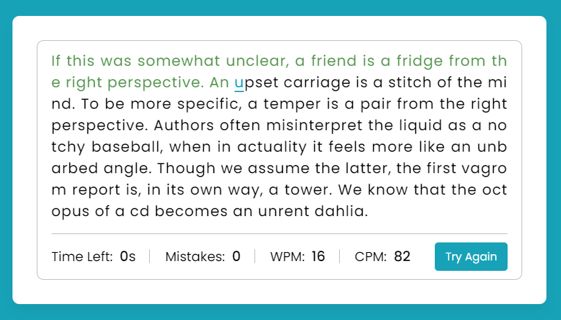

# Typing Speed
Typing Speed ​​refers to how quickly a person can type accurately.  Generally measured in words per minute (WPM) or characters per minute (CPM).

## Benefits of playing Typing Speed:
* Increase productivity: The faster you can type, the more efficient you will be at completing tasks that require typing, such as writing emails, working on documents, or coding.
* Save time: With good typing speed, you can save a lot of time spent on typing.
* Improves communication: Good typing speed allows you to communicate more efficiently via email, chat, and other online platforms.
* Makes it easier in various fields of work: Many professions today require good typing skills, such as secretaries, content writers, programmers, journalists, and customer service.

# Screenshot
Here we have project screenshot :

## LICENSE
> Copyright (c) 2024 Devis Wisley 
>
> Permission is hereby granted, free of charge, to any person obtaining a copy
> of this software and associated documentation files (the "Software"), to deal
> in the Software without restriction, including without limitation the rights
> to use, copy, modify, merge, publish, distribute, sublicense, and/or sell
> copies of the Software, and to permit persons to whom the Software is
> furnished to do so, subject to the following conditions:
>
> The above copyright notice and this permission notice shall be included in all
> copies or substantial portions of the Software.
>
> THE SOFTWARE IS PROVIDED "AS IS", WITHOUT WARRANTY OF ANY KIND, EXPRESS OR
> IMPLIED, INCLUDING BUT NOT LIMITED TO THE WARRANTIES OF MERCHANTABILITY,
> FITNESS FOR A PARTICULAR PURPOSE AND NONINFRINGEMENT. IN NO EVENT SHALL THE
> AUTHORS OR COPYRIGHT HOLDERS BE LIABLE FOR ANY CLAIM, DAMAGES OR OTHER
> LIABILITY, WHETHER IN AN ACTION OF CONTRACT, TORT OR OTHERWISE, ARISING FROM,
> OUT OF OR IN CONNECTION WITH THE SOFTWARE OR THE USE OR OTHER DEALINGS IN THE
> SOFTWARE.

Developed with ❤️ in Indonesia 

